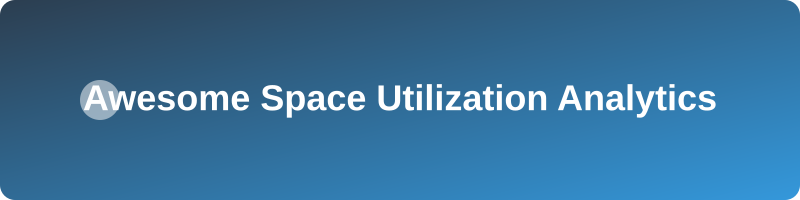

# 🚀 Awesome Space Utilization Analytics
<!-- SEO: Space Utilization, Office Occupancy Analytics, Smart Building Sensors, Real Estate Optimization, Hybrid Workplace Planning, Desk Booking Data, People Counting -->

  

## Top Space Utilization Analytics Platforms Ecosystem

**Curated List of SaaS Products & Open-Source GitHub Projects**  
*Focused on Workplace Occupancy Analytics, Desk & Room Utilization, Sensor-Based Space Intelligence & Real Estate Optimization*  
**Last updated: August 2026**

This repository tracks notable **SaaS platforms** and **open-source projects** for **Space Utilization Analytics**. These tools help organizations measure how office space, desks, meeting rooms, and common areas are actually used through sensors, computer vision, Wi-Fi, or booking data, enabling better real estate decisions and hybrid workplace planning.

**Examples** include XY Sense, Butlr, Locatee, VergeSense, Robin Analytics, OfficeSpace Insights, GoBright Analytics, Density, Occuspace, and PointGrab (the category leaders).

**Open-source emphasis**: This section is heavily expanded with every major active project for occupancy detection, people counting, computer-vision space analytics, sensor data processing, and related open tools — ideal for researchers, smart-building teams, and developers seeking transparent or self-built alternatives to commercial workplace analytics platforms.

Contributions welcome! Open a PR to add/update entries. Keep descriptions factual and link to official sites.

## 📑 Table of Contents
- [SaaS/Hosted Platforms](#saas-hosted-platforms)
- [Open-Source GitHub Projects](#open-source-github-projects)
- [How to Contribute](#how-to-contribute)
- [Disclaimer](#disclaimer)

## 🏢 SaaS/Hosted Platforms

| Product | Description | Pricing | Free Tier Limit | Company Size (Valuation) |
|---|---|---|---|---|
| **[Density](https://www.density.io/)** | Occupancy sensor and analytics platform providing real-time and historical people-counting data for space optimization. | ~$1,800 per sensor | 0 days (Demo only) | ~$1.0B |
| **[VergeSense](https://www.vergesense.com/)** | AI-powered spatial intelligence platform using computer vision sensors to deliver granular occupancy data and predictive workplace planning. | ~$1,800 per sensor | 0 days (Demo only) | ~$500M |
| **[OfficeSpace Insights](https://www.officespacesoftware.com/)** | Space management and utilization analytics tools designed for enterprise real estate and facilities teams. | ~$22,000 annually | 0 days (Demo only) | ~$150M |
| **[Robin Analytics / Robin](https://robinpowered.com/)** | Desk and room booking platform with analytics that reveal utilization patterns and support hybrid workplace operations. | ~$15,000 annually | 14-day free trial | ~$100M |
| **[Butlr](https://www.butlr.com/)** | Privacy-first thermal (body-heat) sensing platform that provides occupancy, dwell time, and space utilization data without cameras or personally identifiable information. | ~$295 for starter kits | 0 days (Demo only) | ~$50M |
| **[Locatee](https://www.locatee.com/)** | Workplace analytics solution focused on desk and space utilization insights derived from existing IT and building data sources. | ~$15,000 annually | 0 days (Demo only) | ~$50M |
| **[XY Sense](https://xysense.com/)** | Workplace sensor platform delivering accurate occupancy and utilization analytics across open-plan offices and meeting spaces. | ~$0.05 per sq. ft. per month | 0 days (Demo only) | ~$30M |
| **[PointGrab](https://www.pointgrab.com/)** | AI-based workplace sensing and analytics platform that measures occupancy and activity for smarter space management. | ~$1,000 per sensor | 0 days (Demo only) | ~$30M |
| **[GoBright Analytics](https://gobright.com/)** | Smart workplace platform offering room and desk booking together with utilization reporting and analytics. | ~£2.30 per license/month | 30-day free trial | ~$20M |
| **[Occuspace](https://www.occuspace.io/)** | Occupancy monitoring solution focused on real-time space utilization insights for offices and public environments. | ~$600 per year | 0 days (Demo only) | ~$10M |

## 💻 Open-Source GitHub Projects

- **[YOLOv8](https://github.com/ultralytics/ultralytics)** 
  Ultralytics YOLOv8 for state-of-the-art object detection, instance segmentation and image classification.

- **[YOLOv5](https://github.com/ultralytics/yolov5)** 
  YOLOv5 in PyTorch > ONNX > CoreML > TFLite. Widely used for object detection including people counting for occupancy analytics.

- **[Supervision + Occupancy Analytics Pipelines](https://github.com/roboflow/supervision)** 
  Open-source computer-vision utilities frequently used to build occupancy, zone utilization, and heatmap analytics from camera feeds.

- **[DeepParking](https://github.com/DeepParking/DeepParking)** 
  Open-source computer-vision solution for detecting vacant parking spots; adaptable concepts for other space-occupancy use cases.

- **[NVs.OccupancySensor](https://github.com/nvsnkv/NVs.OccupancySensor)** 
  OpenCV-based optical occupancy sensor that detects presence via background subtraction and publishes results over MQTT (Home Assistant compatible).

- **[Office Seat Occupancy Detection](https://github.com/Nisrgg/Office-Seat-Occupancy-Detection)** 
  Computer-vision project using YOLOv8 for real-time detection and tracking of office seat occupancy, with pattern analysis and utilization metrics.

- **[OccupyAI](https://github.com/CarlosG-05/OccupyAI)** 
  Open-source system for monitoring study room or office occupancy with computer vision, Raspberry Pi clients, FastAPI backend, and cloud storage.
### Additional Strong Open-Source Options

- **Computer vision pipelines**: YOLO-based detection + tracking projects form the most practical starting point for camera-driven occupancy analytics.
- **Edge & IoT**: MQTT/Home Assistant occupancy sensors and Raspberry Pi deployments for low-cost monitoring.
- **Analytics layer**: Open dashboards and notebooks that convert detection events into utilization metrics.
- **Research foundations**: Academic occupancy and spatial AI repositories that advance the state of the art.
- Many internal and community **workplace sensing** and **people-counting** projects continue to appear on GitHub.

**Frameworks for building custom systems**: Combine **open computer-vision models (YOLO + Supervision)** for detection, edge devices or existing cameras for data capture, MQTT or simple APIs for event streaming, and open analytics/visualization tools to create a practical self-hosted space utilization analytics pipeline.

## 🤝 How to Contribute

1. Fork the repo.
2. Add/edit entries in `README.md` (follow existing format).
3. Include: name, link, 1–2 sentence description, and whether it's SaaS or open-source.
4. Submit PR with a short explanation.

Star the repo if you find it useful!

## ⚠️ Disclaimer

- This is a **community-curated** list — not exhaustive and not an endorsement.
- Space utilization systems often involve cameras or sensors in workplaces; privacy, employee consent, and compliance with local regulations (GDPR, CCPA, etc.) are critical.
- Self-hosted open-source solutions require careful attention to data protection, accuracy validation, and integration with existing building or IT systems.

---

**Made for workplace strategists, corporate real estate teams, facilities managers, and smart-building developers.**  
Let's make space utilization analytics more open, privacy-aware, and data-driven.

## 📈 Star History

<a href="https://www.star-history.com/?repos=ishandutta2007/Awesome-Space-Utilization-Analytics&type=date&legend=bottom-right">
<picture>
<source media="(prefers-color-scheme: dark)" srcset="https://api.star-history.com/chart?repos=ishandutta2007/Awesome-Space-Utilization-Analytics&type=date&theme=dark&legend=bottom-right" />
<source media="(prefers-color-scheme: light)" srcset="https://api.star-history.com/chart?repos=ishandutta2007/Awesome-Space-Utilization-Analytics&type=date&legend=bottom-right" />

</picture>
</a>

# Awesome-Space-Utilization-Analytics

